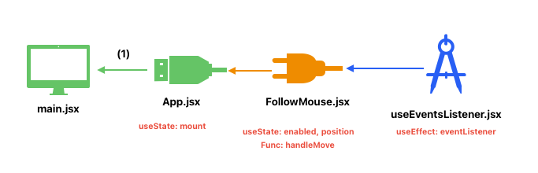
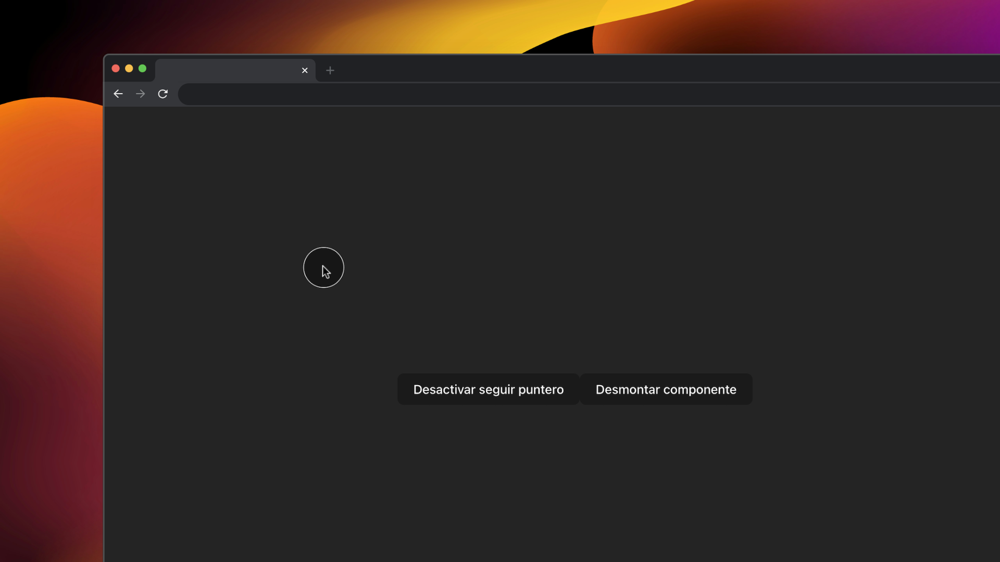

# RATÓN SEGUIDOR

Primero pensamos en que vamos a hacer.
Vamos a crear una app para seguir el puntero. En muchos portfolios que te habrás dado cuenta de que cuando sigues el puntero hay como una bola alrededor del puntero pues ese efecto lo vamos a conseguir en este proyecto vamos a hacer un proyecto en el que pueda seguir el puntero (esa bolita) con una animación bastante bonita pero que además podemos activar y desactivar, etcétera.

Lo que vamos a hacer realmente (y queremos) es ser capaces de detectar cuál es la posición del ratón en la pantalla porque vamos a querer seguirla y hacer un efecto que cada vez que se mueve junto nosotros.

## 2 COMPONENTES
FollowMouse.jsx

Descripción:
La funcionalidad total del puntero

useEventsListener.jsx

Descripción:
Es un customHook con el useEffect para lanzar el evento de escucha del puntero.

## 4 HOOKS (UseState (3), UseEffect (1))

mount: activar o desactivar el componente ‘FollowMouse’
enabled: activar o desactivar el puntero
position: saber la posición del puntero (x, y)

useEffect: para suscribirse al evento de seguir el puntero por el navegador.

## LÓGICA

Como se podrá activar o desactivar el puntero eso ya sería un estado con un botón para activar o desactivar el estado.

Creamos el puntero de forma estática.

Para crear el evento de suscripción de donde seguimos el ratón y pasárselo al puntero, deberíamos usar un useEffect, ya que tenemos que controlar cuando nos vamos a subscribir a un evento y que no se renderice constantemente el componente.

Creamos un nuevo estado de un objeto con los dos posibles datos de posición (x,y)
Creamos una función de evento que vaya modificando el estado del objeto.

Creamos un useEffect donde aparte se recibe el tipo de enveto en este caso sería ‘pointermove’, la función del evento (nombrada justa anteriormente)y el valor del estado para activar o no. Gracias eso dentro useEffect creamos la suscripción (si el estado este true) y luego retornamos la limpieza o descripción.

Todo esto lo podemos añadir dentro de un componente padre como (App) para crear otro estado y poder montar o desmontar la práctica.

### ESQUEMA

  

### INTERFAZ

  

